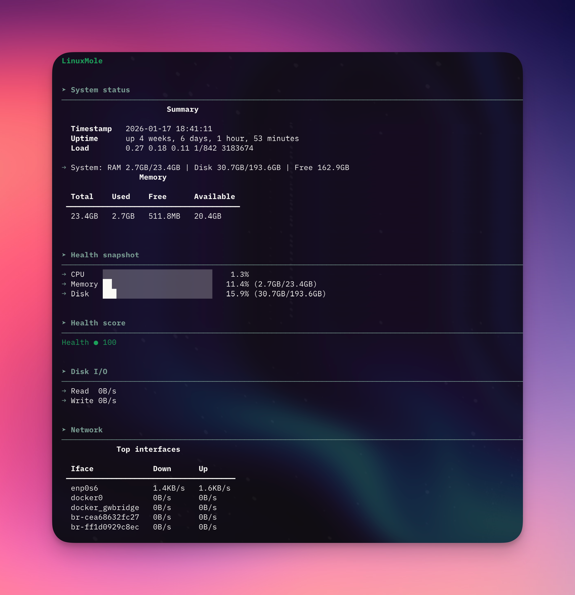
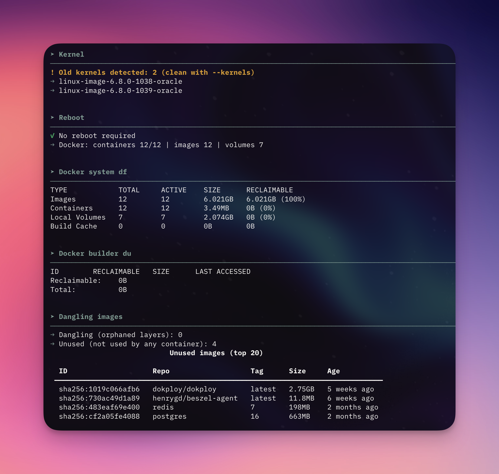

# LinuxMole

*Safe maintenance for Linux + Docker, inspired by [Mole for macOS](https://github.com/tw93/mole), a wonderful project.*

[](https://github.com/4ndymcfly/linux-mole/stargazers)
[](https://github.com/4ndymcfly/linux-mole/releases)
[](LICENSE)
[](https://www.python.org/)
[](https://github.com/4ndymcfly/linux-mole/commits)
[](https://pypa.github.io/pipx/)

## Overview

LinuxMole is a Mole-like CLI for Linux servers with Docker. It focuses on safe, transparent maintenance with previews, structured output, and explicit confirmation.

## Features

- Mole-like console UX with structured sections and previews
- Safe-by-default cleanup with explicit confirmation
- Docker-aware maintenance (images, networks, volumes, logs)
- System maintenance (journald, tmpfiles, apt, caches)
- Whitelist support and detailed preview logs

## Help Output

```text
 _      _                     __  __       _
| |    (_)                   |  \/  |     | |
| |     _ _ __  _   ___  __  | \  / | ___ | | ___
| |    | | '_ \| | | \ \/ /  | |\/| |/ _ \| |/ _ \
| |____| | | | | |_| |>  <   | |  | | (_) | |  __/
|______|_|_| |_|\__,_/_/\_\  |_|  |_|\___/|_|\___|

https://github.com/4ndymcfly/linux-mole

Safe maintenance for Linux + Docker.


COMMANDS
lm                      Main menu
lm status               Full status (system + docker)
lm status system        System status only
lm status docker        Docker status only
lm clean                Full cleanup (system + docker)
lm clean system         System cleanup only
lm clean docker         Docker cleanup only
lm analyze              Analyze disk usage
lm purge                Clean project build artifacts
lm installer            Find and remove installer files
lm whitelist            Show whitelist config
lm uninstall            Remove LinuxMole from this system
lm --version            Show version
lm update               Update LinuxMole (pipx)


OPTIONS (clean only)
--dry-run               Preview only, no actions executed
--yes                   Assume 'yes' for confirmations
-h, --help              Show help


EXAMPLES
  lm status
  lm status --paths
  lm status docker --top-logs 50
  lm clean --containers --networks --images dangling --dry-run
  lm clean docker --images unused --yes
  lm clean docker --truncate-logs-mb 500 --dry-run
  lm clean system --journal --tmpfiles --apt --dry-run
  lm clean system --logs --logs-days 14 --dry-run
  lm clean system --kernels --kernels-keep 2 --dry-run
  lm analyze --path /var --top 15
  lm purge
  lm installer
  lm whitelist
  lm --version
  lm update
```

## Installation

### Recommended (pipx)

1) Install pipx:
```bash
sudo apt update && sudo apt install -y pipx
pipx ensurepath
```

2) Install LinuxMole:
```bash
pipx install "git+https://github.com/4ndymcfly/linux-mole.git"
```

3) Run:
```bash
lm status
```

### Legacy (optional)

```bash
sudo ./install-linuxmole.sh
```

## Commands

- `lm status` Full status (system + docker)
- `lm status system` System status only
- `lm status docker` Docker status only
- `lm clean` Full cleanup (system + docker)
- `lm clean system` System cleanup only
- `lm clean docker` Docker cleanup only
- `lm analyze` Analyze disk usage
- `lm purge` Clean project build artifacts
- `lm installer` Find and remove installer files
- `lm whitelist` Show whitelist config
- `lm uninstall` Remove LinuxMole from this system
- `lm --version` Show version
- `lm update` Update LinuxMole (pipx)

## Clean Examples

```bash
lm clean --containers --networks --images dangling --dry-run
lm clean system --journal --tmpfiles --apt --dry-run
lm clean system --logs --logs-days 14 --dry-run
lm clean system --pip-cache --npm-cache --cargo-cache --go-cache --dry-run
lm clean system --snap --flatpak --logrotate --dry-run
lm clean system --kernels --kernels-keep 2 --dry-run
```

## Analyze / Purge / Installer

```bash
lm analyze --path /var --top 15
lm purge
lm installer
```

## Whitelist / Config

- Whitelist file: `~/.config/linuxmole/whitelist.txt`
- Purge paths file: `~/.config/linuxmole/purge_paths`
- Edit whitelist: `lm whitelist --edit`

## Screenshots



## Contributing

See `CONTRIBUTING.md` for guidelines.

## Release

See `PUBLISHING.md` for the PyPI/pipx release workflow.

1) Update version in `pyproject.toml` and `lm.py`
2) Tag and push: `git tag vX.Y.Z && git push --tags`
3) Users upgrade: `pipx upgrade linuxmole`

## Acknowledgements

Thanks to the original Mole project for inspiration: https://github.com/tw93/mole
